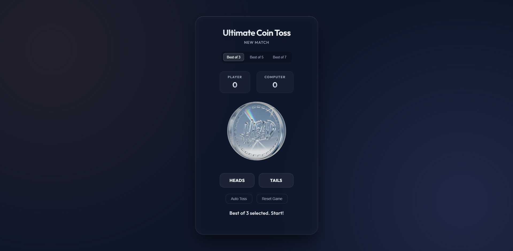
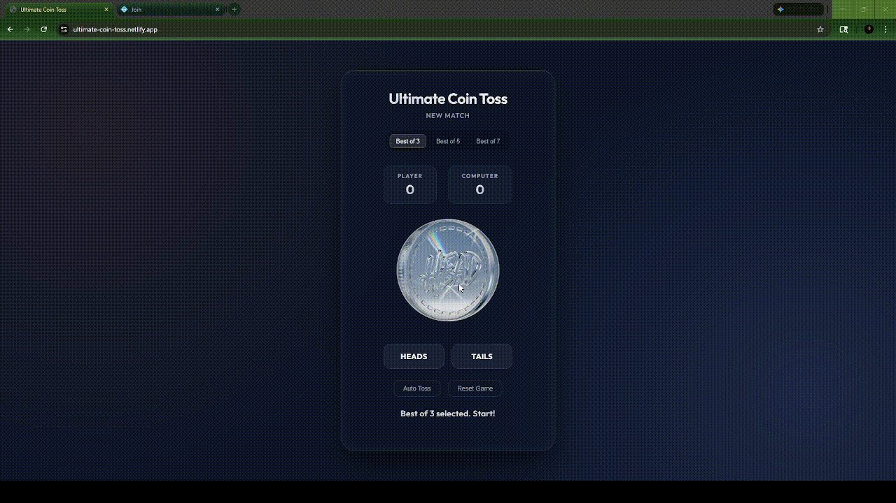

<h1 align="center">Ultimate Coin Toss</h1>

<p align="center">
  
</p>

<p align="center">
  <a href="https://ultimate-coin-toss.netlify.app/">🔗 ultimate-coin-toss.netlify.app</a>
</p>

<p align="center">
  A high-fidelity, interactive browser-based coin toss simulation engineered with pure HTML, CSS, and JavaScript — featuring glassmorphism UI, procedural 3D flip physics, real-time score state management, and a canvas-rendered particle system.
</p>

---

## Gameplay Preview

<p align="center">
  
</p>

---

## System Architecture Overview

The system provides competitive match configurations (Best-of-3, Best-of-5, Best-of-7). In each trial, user inputs are validated against randomized outcomes. The application manages score state dynamically and triggers visual feedback mechanisms upon state changes (e.g., match point reached, victory achieved). An autonomous execution loop provides simulated match playback.

---

## Key Capabilities

| Capability | Description |
| :--- | :--- |
| **Stochastic 3D Animation** | Procedurally generated CSS keyframes calculate trajectory and spin velocity dynamically per interaction cycle. |
| **State Controller** | Real-time multi-variable state tracking encompassing user performance vs. CPU. |
| **Match Point Telemetry** | Predictive visual indicators when a conclusive victory is imminent. |
| **Canvas Particle Renderer** | Hardware-accelerated fireworks effect deployed upon match resolution. |
| **Autonomous Playback** | Configurable automated trial execution loops for simulation. |
| **Modern UI Patterns** | Translucent frosted-glass aesthetic utilizing `backdrop-filter: blur`. |

---

## Technology Stack

| Technology | Implementation Role |
| :--- | :--- |
| **HTML5** | Semantic DOM structure and Canvas API integration. |
| **CSS3** | Hardware-accelerated 3D transforms (`preserve-3d`, `backface-visibility`), modular UI design, and dynamic CSSOM mutations. |
| **Vanilla JS** | Application logic encapsulated within an IIFE-based Module Pattern, utilizing `requestAnimationFrame` and Canvas rendering. |
| **Typography** | Google Fonts — *Outfit*. |

---

## Technical Implementation Details

- **3D Spatial Rendering:** Employs CSS `perspective` interacting with `rotateY()` to construct 3D depth during flip animations.
- **Visual Isolation:** Uses `backface-visibility: hidden` to properly render obverse/reverse coin faces.
- **State Encapsulation:** Implements a JavaScript Module Pattern (`const game = (() => {})()`) to prohibit global scope pollution.
- **Procedural Particle Generation:** HTML5 Canvas API renders stochastic, velocity-based particle trajectories unconstrained by DOM node limits.
- **Dynamic CSS Injection:** Mutates `styleSheet.textContent` at runtime to generate unique rotation vectors per flip.

---

## Environment Setup

Zero external build dependencies — runs directly in the browser.

```bash
# Clone the repository
git clone https://github.com/SAPTARSHI-coder/ultimate-coin-toss.git

# Open in browser
open index.html
```

---

## License

This project is licensed under the MIT License — see the [LICENSE](LICENSE) file for details.
